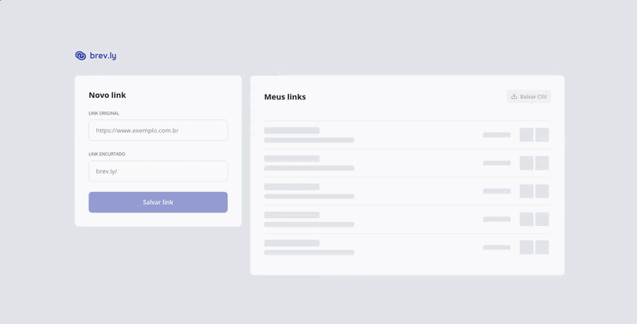

> Encurtador de URLs Full Stack desenvolvido com **React**, **Fastify**, **PostgreSQL**, **Drizzle ORM** e **Docker**.


---

# 🎬 Preview




---

# 📌 Sobre

O Brev.ly é um projeto Full Stack desenvolvido durante um desafio da Rocketseat.

Além dos requisitos originais, o projeto foi expandido com foco em:

- Arquitetura limpa
- Organização por funcionalidades
- Escalabilidade
- Docker como ambiente principal de desenvolvimento
- Documentação completa
- Boa experiência para desenvolvedores (DX)

A interface foi construída a partir do layout disponibilizado pela Rocketseat para fins educacionais.

---

# 🎯 Objetivos

Este projeto demonstra a utilização de:

- React moderno
- Fastify
- PostgreSQL
- Drizzle ORM
- Docker Compose
- Nginx
- Cursor Pagination
- Cloudflare R2
- Monorepo com pnpm Workspace

---

# ✨ Funcionalidades

## Frontend

- Criar links
- Validação de formulários
- Tratamento de erros da API
- Infinite Scroll
- Skeleton Loading
- Loading nos botões
- Copiar link
- Remover link
- Download CSV

## Backend

- Criar link
- Remover link
- Redirecionar link
- Contador de acessos
- Paginação por cursor
- Exportação CSV
- Upload para Cloudflare R2
- OpenAPI + Scalar
- Seed de banco

---

# 🏗️ Arquitetura

```text
Browser
   │
   ▼
 Nginx
 ├── React
 └── /api
      │
      ▼
 Fastify
      │
      ▼
 PostgreSQL

Cloudflare R2
      ▲
      │
 Exportação CSV
```

---

# 🛠️ Tecnologias

## Frontend

- React 19 — Interface
- TypeScript — Tipagem
- Vite — Build
- Tailwind CSS 4 — Estilização
- React Router — Rotas
- TanStack Query — Cache e estado assíncrono
- React Hook Form — Formulários
- Zod — Validação
- Axios — Cliente HTTP

## Backend

- Fastify — API REST
- PostgreSQL — Banco de dados
- Drizzle ORM — ORM
- Zod — Validação
- AWS SDK — Cloudflare R2
- Scalar — Documentação

## Infraestrutura

- Docker
- Docker Compose
- Nginx
- pnpm Workspace

---

# 📁 Estrutura

```text
.
├── server/
├── web/
├── docker-compose.yml
├── package.json
├── pnpm-workspace.yaml
└── README.md
```

---

# ⚙️ Pré-requisitos

## Docker (Recomendado)

- Docker
- Docker Compose

## Desenvolvimento Local

- Node.js 22+
- pnpm 11+
- Docker
- Docker Compose

---

# 🚀 Executando

## Configuração

Antes de executar o projeto, copie os arquivos de exemplo das variáveis de ambiente.

### Backend

```bash
cp server/.env.example server/.env
```

Variáveis disponíveis:

- `PORT`
- `DATABASE_URL`
- `CLOUDFLARE_ACCOUNT_ID`
- `CLOUDFLARE_ACCESS_KEY_ID`
- `CLOUDFLARE_SECRET_ACCESS_KEY`
- `CLOUDFLARE_BUCKET`
- `CLOUDFLARE_PUBLIC_URL`

### Frontend

```bash
cp web/.env.example web/.env
```

Variáveis disponíveis:

- `VITE_BACKEND_URL`
- `VITE_API_DELAY_MS`

### Ambiente Local

Durante o desenvolvimento, o frontend realiza as requisições diretamente para o backend.

```env
VITE_BACKEND_URL=http://localhost:3333
```

### Docker

Durante o build da imagem do frontend, o valor de `VITE_BACKEND_URL` é substituído automaticamente para:

```env
VITE_BACKEND_URL=/api
```

Todas as requisições são encaminhadas pelo **Nginx**, que atua como proxy reverso para o container do servidor.

---

## 🐳 Executando com Docker (Recomendado)

Suba toda a infraestrutura:

```bash
pnpm docker:up
```

Aplique as migrations do banco de dados:

```bash
pnpm docker:db:migrate
```

Se desejar popular o banco com aproximadamente **20.000 links** para testes de paginação e performance:

```bash
pnpm docker:db:seed
```

Após iniciar os containers, os serviços estarão disponíveis em:

| Serviço             | Endereço                   |
| ------------------- | -------------------------- |
| Frontend            | http://localhost           |
| Backend             | http://localhost:3333      |
| Documentação da API | http://localhost:3333/docs |

---

## 💻 Desenvolvimento Local

Caso prefira executar o frontend e o backend diretamente pela máquina, mantenha apenas o banco de dados em execução através do Docker.

Inicie a infraestrutura:

```bash
pnpm docker:db
```

Em seguida, execute cada aplicação:

```bash
pnpm dev:server
pnpm dev:web
```

Endereços durante o desenvolvimento:

| Serviço  | Endereço              |
| -------- | --------------------- |
| Frontend | http://localhost:5173 |
| Backend  | http://localhost:3333 |

---

## 📜 Scripts

### Desenvolvimento

```bash
# Inicia o servidor Fastify em modo de desenvolvimento
pnpm dev:server

# Inicia o frontend React com Vite
pnpm dev:web
```

### Qualidade de código

```bash
# Gera a build de produção de todos os workspaces
pnpm build

# Executa o ESLint em todos os projetos
pnpm lint

# Formata automaticamente o código com Prettier
pnpm format
```

### Docker

```bash
# Inicia toda a infraestrutura (PostgreSQL, API e Frontend)
pnpm docker:up

# Encerra todos os containers
pnpm docker:down

# Exibe os logs dos containers em tempo real
pnpm docker:logs
```

### Banco de dados

```bash
# Inicia apenas o PostgreSQL
pnpm docker:db

# Encerra apenas o PostgreSQL
pnpm docker:db:stop

# Aplica as migrations pendentes
pnpm docker:db:migrate

# Popula o banco com aproximadamente 20.000 links para testes
pnpm docker:db:seed
```

---

## 🐋 Infraestrutura Docker

O projeto é composto pelos seguintes serviços:

| Serviço    | Descrição                         |
| ---------- | --------------------------------- |
| `postgres` | Banco de dados PostgreSQL         |
| `server`   | API Fastify                       |
| `web`      | Frontend React servido pelo Nginx |

Além dos serviços principais, o Docker Compose disponibiliza ferramentas auxiliares através do perfil **tools**:

| Ferramenta  | Descrição                               |
| ----------- | --------------------------------------- |
| `migration` | Executa as migrations do banco de dados |
| `seed`      | Popula o banco com dados para testes    |

---

### Serviços Docker

- postgres
- server
- web

Ferramentas:

- migration
- seed

---

# 📚 Documentação técnica

A documentação do Brev.ly foi organizada em módulos para manter cada contexto isolado e facilitar a consulta.

## Módulos

| Módulo | Descrição | Documentação |
|---|---|---|
| Web | Interface React, componentes, estados e integração com API | [web/README.md](web/README.md) |
| Server | API Fastify, banco de dados, serviços e integrações | [server/README.md](server/README.md) |

---

# 📄 Licença

MIT
